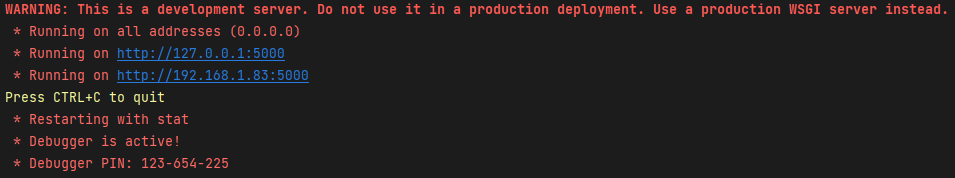

# NT Bar
# Summary
This repository contains two main components:

- Server (Larger screen with no player interaction). This runs on localhost:3000
- Client (Smaller screens which players interact with). This runs on localhost:5000

## Server

The server displays a number of statistics about the room:

- The progress for each game, represented via parts of an image becoming clear and a secret word appearing under once
  completed.
- The high scores for each game, saved globally
- Who is currently playing, or who last played
- How long someone has been playing for, or how long since the last player played
- How many attempts have been made, and how many people have attempted the game

There is also an introduction text to provide context for the games. Once all the games are complete, a server end
screen is displayed with more text summarising the end of the story and game.

## Client

The client contains four different games, three of which are accessible at any given moment. These are:

- Item Catch (Master the dance): Good/bad items randomly appear on the screen and the user is expected to click on
  enough good items within the time to win
- Riddles (Charades): A riddle is shown from a collection and the user is either presented with a list of multiple
  choice options, or they are expected to enter the answer into a text box
- Tile Shift (Needlepoint): An image is split into a 3x3 or 4x4 grid and scrambled, where the tiles need to be swapped
  around to create the original image
- OR Cypher: A cypher is created with a series of symbols and the key is provided, the user is then expected to decode
  the message and type the answer. Note that this game hasn't been modified from the original design and isn't intended to be used for experimentation

Each game contains three main sreens, an introduction screen with an image, a text description defining context and
background; a game screen with the specific game's content; and a game complete screen. This final screen either shows a
single game win/lose screen, or a more comprehensive minigame complete screen, providing the user with a **bold** hint
phrase, hinting towards the answer.

# Running

## Non-Technical

Note: Client refers to the "small" computers that run the games, and Server refers to the "big" computer that shows the tasks

For the sake of experimentation, the built exe files will be used. In this case, the following steps can be used:
- Download/locate the `Server.exe` and `Client.exe` files.
- Put the `Server.exe` file on the computer to be running the server, and three `Client.exe` 's on each of the client computers
- Run the respective files on the computers. Make sure to accept any firewall prompts if they come up. You should then be presented with something like the following. 

- Here you can take note of the server IP address for a future step, e.g. 192.168.1.83:
- From there, it should be possible to open Google Chrome and navigate to `localhost:3000` for the server, or `localhost:5000` for the clients
- On each of the client's, type the server IP address into the text box, then click submit. The website should confirm if the connection was successful or not
- The system should then be ready to use. To change configuration, see the [configuration](#Configuration) section.
Note: If running using 32" 4k screens, keep windows scaling to 1x and set the browser zoom to 75%. If using the 65" 4k screen, set windows scaling to 150% and keep the browser zoom at 0%.

### Character Sheet
Below is a list of all the characters described in the application, along with their job and relationship to the main character. This can be used to make the experience seem more like a real whodunnit game.

- Isobel Payne: This is your friend who you are trying to help, accused of adultery (with Frederick) and murder 
- Frederick Payne: The Earl of Scargrave, this is the man who has been murdered, accused of adultery and murder
- Viscount Payne: The younger brother and heir to the Earl
- James Beridze: The Earl's best friends
- Davit Tsiklauri: The Earl's eldest coisin
- Eliza de Feuillide: Your cousin
- Lieutenant Thomas Hearst: The second son of the Earl's deceased sister
- George Hearst: The first son of the Earl's deceased sister/ Thomas' elder brother
- Miss Fanny Delahoussaye: Mutual friend and riddle enthusiast 

## Technical

There are three built in ways to run this system:

- Natively using python, either by running the respective `app.py`, or by using an IDE's run tools to hook into a Flask
  app
- Using Docker via the respective `Dockerfile` or `Makefile`
- Building and running the exe's generated through `create_exe.py`

## Server

Once running, the server home page can be accessed via localhost:3000. Pressing F12 should reveal the local IP address,
which is required if the clients are connecting from another machine on the network.

Keycode:

r - Resets timers (2nd row from bottom)

l - Resets leaderboards

enter - Resets the room (all rows except for leaderboards), small computers need refreshing

w - Triggers the win game screen, in case people guess it on thier own behalf

## Client

Once running, the client home page can be accessed via localhost:5000. If running on a different machine to the server,
the local IP address found on the server console needs to be entered and submitted on the home page, otherwise
localhost:3000 will be used. From here, all the currently available games can be accessed via hyperlinks. There is a
configuration reset button, in case options want to be set to default.

# Configuration

A number of game options can be changed during runtime by navigating to the /config page within the game e.g.
needlepoint/config. These options range from toggling timers, setting difficulties or the order in which riddles appear
to the user. Once submitted, the game page will load with the set configuration. Configurations are stored locally in
the browser.

## Shared Configuration

- Hide Progress on Client Side: If enabled, hides the progress image shown on the game start screen (shown by default)
- Hide Leaderboard on Client Side: If enabled, hides the leaderboard table shown on the game start screen (shown by
  default)
- Timer: All games can have a timer. -1 defines no timer (unlimited time) (default is 100 for Dance, -1 for others)
- Number to Win: All games need to be played n times to be complete on server side (default n = 3)

## Master the Dance Configuration

- Step Count: The number of steps that can appear in a session. Typically, shouldn't occur given default the timer constraints (default 300)
- Win score: The score required for the player to win (default 30)
- Time on screen: The time the steps appear on screen. This is random, between 1 and n*250ms (default n = 10)
- Time between spawns: The time the steps are hidden for between steps, This time is random, between 1 and n*250ms (
  default n = 4)
- Disable fade out: Disables the fading to 0 opacity feature as steps time out (steps fade out by default)
- Show target score on client side: Shows the target score and progress towards target on the screen (default is off)
- Show timer on client side: Shows the timer on the screen (default is off))
- Show steps left on client side: Shows how many steps are left on the screen (default is off)
- Show bad steps upside down: Rotates bad steps by 180 degrees to be easier (default is off)
- All steps at random rotation: Rotates all the steps by a random amount to be harder (default is off)
- Show tutorial game screen: Shows a hint on the top, explaining which steps are good and bad to be easier (default is
  off)

## Charades Configuration

- Riddle order (comma separated numbers, 0-8): This is the number to win for this game, represented in the form of a
  comma separated list of numbers from 0-8, so the riddle order can be defined too. (Default is 0,7,5,6,8,2,1,4,3)
- Multiple Choice: Toggles if the user is presented with a text box or multiple choice boxes (default off)
- Choices Displayed (up to 4): If multiple choice is on, defines the number of options (default is three)

## Needlepoint Configuration

- Preview Timer (s): Sets the number of seconds the image pre/postview is displayed for (default 1 second)
- Preview: Displays the image before the puzzle starts to make it easier (default off)
- Disable show image on complete: Disables the image being shown after completion (default image is shown)
- 3x3 Mode: Changes the grid size from 4x4 to 3x3 (default is 4x4)

# Building

The majority of the code is built using Python Flask as a back end, and native HTML, JS and CSS for the front end, and
thus doesn't need rebuilding and can be updated on-the-fly (particularly if the Flask Debug is set
to True). However, the Tile Shift/Cypher games are built using React, and thus need to be built and copied prior to
loading. This can be done by making any changes within `src/client/cypher-tile-shift/`, then running
either `run_local.bat` or `run_local.sh` if running Windows or Linux/macOS respectively. The script should handle
building the project and moving the respective files to their correct locations

# Adding or Changing Content

## Adding Content

## Changing Content

# Changes Compared to Original

## Server

## Master the Dance 

## Charades 

## Needlepoint